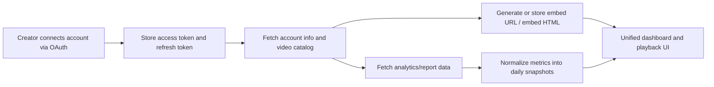

# Platform API Research Report for Creator Video Analytics

## Executive summary

If your Phase 1 goal is **creator-connected analytics plus playable embeds, without importing media**, the clear best starting point is **YouTube**. It offers the richest documented self-serve analytics surface of the platforms reviewed here: per-video reporting, watch-time metrics, audience-retention metrics, engagement, subscriber gains/losses, and audience-demographic reporting, plus easy deterministic embed URLs and standard player support. TikTok is the easiest short-form follow-on if you can accept that its public creator APIs expose **public counters and profile stats**, not true creator-analytics depth such as watch time, retention, impressions, CTR, or demographics. Facebook’s Page video API is also strong on analytics, including watch time, retention graphs, impressions, and Reels metrics, but it is oriented to **Page-owned videos**, not arbitrary personal-profile content. Instagram is strategically important, but in this research session I was able to fully verify **Instagram oEmbed** from official Meta docs and only partially verify the current analytics references; I would therefore treat Instagram analytics as a **second-wave integration that needs implementation-time doc verification** before committing build scope. Vimeo clearly has official API and oEmbed surfaces, but I could not fully extract the current analytics metric catalog from the public docs in-session. Twitch has excellent embed support and VOD metadata, but its official analytics APIs are for **games and extensions**, not creator VOD/video-performance analytics.

For a Phase 1 product, the practical takeaway is this: build a connector model that stores **OAuth tokens, video catalog metadata, platform-native IDs, embed/play URLs, and your own daily metric snapshots**. Do not depend on any platform to act as your historical warehouse. TikTok’s public APIs do not expose historical time-series analytics. Twitch’s analytics are not creator-video analytics. Meta’s Instagram oEmbed docs explicitly forbid using oEmbed metadata/content for analytics or persistence. YouTube and Facebook expose more analytics depth, but even there you will want your own normalized snapshot tables for stable cross-platform comparisons and historical dashboards.

## Comparison snapshot

**Legend:** Yes = directly documented and practical for Phase 1; Partial = some support, but with meaningful gaps or restrictions; No = not documented for creator-video analytics in the official sources reviewed here; Needs verification = official surface exists or is highly likely, but I could not fully validate the current metric catalog from primary docs in-session.

| Platform | Analytics API | Views | Watch time | Retention curve | Impressions / CTR | Likes / comments / shares | Subs / follows gained | Demographics | Embed / player | oEmbed | Phase 1 fit | Official basis |
|---|---|---:|---:|---:|---:|---:|---:|---:|---:|---:|---|---|
| YouTube | Yes | Yes | Yes | Yes | Partial | Yes | Yes | Yes | Yes | Not revalidated in-session | **Best first** | `reports.query`, metrics, channel reports, Data API, player docs |
| TikTok | Limited public stats, not deep creator analytics | Yes | No | No | No | Yes | No per-video gain metric | No | Yes | Yes | **Good second** if shallow analytics are acceptable | Display API + Video Object + rate limits + oEmbed/player docs |
| Instagram | Needs implementation-time verification | Partial | Partial | Partial | Partial / unclear | Partial | Partial / unclear | Partial / unclear | Yes | Yes | **Later**, after Meta doc/pass review verification | Instagram oEmbed docs fully verified; analytics references not fully retrieved in-session |
| Facebook | Yes for Page videos / Reels | Yes | Yes | Yes | Yes / CTR unclear | Partial to Yes | Partial | Partial / not video-level in sources reviewed | Needs verification | Needs verification | **Strong**, if Page-owned content matters | Video insights guide + reference |
| Vimeo | Needs implementation-time verification | Likely | Needs verification | Needs verification | Needs verification | Likely | Needs verification | Needs verification | Yes | Yes | **Later**, after plan-specific verification | Official Vimeo API reference/oEmbed/rate-limit pages detected |
| Twitch | No creator-video analytics API | Metadata only | No | No | No | No meaningful per-video engagement in reviewed docs | No per-video gain metric | No | Yes | Not confirmed | **Low priority** | Helix analytics is for extensions/games; VOD metadata + embed are separate |

The most important product implication is that if you want **cross-platform comparability** in Phase 1, your cleanest initial normalized schema is probably: `views`, `watch_time_seconds`, `avg_view_duration_seconds`, `retention_curve_json`, `likes`, `comments`, `shares`, `subscribers_gained`, `impressions`, `ctr`, `audience_demographics_json`, `embed_url`, `platform_video_url`, and `snapshot_date`. On YouTube and Facebook, many of these can be filled directly. On TikTok, several fields will remain null by design. On Twitch, only metadata and view counts are realistically available in the official creator-video surfaces reviewed here. On Instagram and Vimeo, keep nullable columns and verify exact availability during implementation.

## Platform findings

### YouTube

**Availability and exposed metrics.** The YouTube Analytics API `reports.query` method is the strongest creator-facing analytics interface in this set. Official docs describe targeted report queries over a channel or content owner, with dimensions, filters, and metrics. The metrics/catalog and channel reports together show support for `views`, `estimatedMinutesWatched`, `averageViewDuration`, `averageViewPercentage`, `comments`, `likes`, `shares`, `subscribersGained`, `subscribersLost`, and `viewerPercentage` for audience demographics. The metrics page also documents audience-retention metrics such as `audienceWatchRatio`, keyed by the `elapsedVideoTimeRatio` dimension, which is the basis for retention-curve style analysis. CTR-like public exposure in the developer docs I pulled is **mainly for cards and annotations** (`cardClickRate`, `cardTeaserClickRate`, `annotationClickThroughRate`) plus ad-impression metrics such as `adImpressions` and `cpm`; I did **not** see the Studio-style thumbnail “impressions click-through rate” documented in the public Analytics API pages I retrieved, so I would mark generic CTR as **partial** rather than full. Audience demographics are documented as age/gender viewer percentages, not raw unique-user exports.

**Endpoints and example shapes.** The documented targeted query endpoint is `GET https://youtubeanalytics.googleapis.com/v2/reports`. Channel reports show that you can segment or filter by `video`, so per-video reporting is a first-class fit for your product. The YouTube Data API `videos.list` complements analytics by returning video metadata, statistics, and player data, while the IFrame Player docs show that embed playback URLs are deterministic from the video ID.

An implementation-ready request pattern looks like this. It follows the documented YouTube Analytics query model and the documented embed/player model.

```http
GET https://youtubeanalytics.googleapis.com/v2/reports
  ?ids=channel==CHANNEL_ID
  &startDate=2026-05-01
  &endDate=2026-05-31
  &dimensions=video
  &metrics=views,estimatedMinutesWatched,averageViewDuration,averageViewPercentage,likes,comments,shares,subscribersGained

GET https://www.googleapis.com/youtube/v3/videos
  ?part=snippet,statistics,player
  &id=VIDEO_ID_1,VIDEO_ID_2
```

A normalized internal response shape for your app would look like this:

```json
{
  "platform": "youtube",
  "video_id": "M7lc1UVf-VE",
  "snapshot_date": "2026-05-31",
  "metrics": {
    "views": 12345,
    "watch_time_seconds": 456789,
    "avg_view_duration_seconds": 87,
    "avg_view_percentage": 42.7,
    "likes": 321,
    "comments": 44,
    "shares": 18,
    "subscribers_gained": 12
  },
  "embed_url": "https://www.youtube.com/embed/M7lc1UVf-VE"
}
```

**Authentication and permissions.** Google’s current docs say `reports.query` requests now require the `youtube.readonly` scope, and the same page still lists `yt-analytics.readonly` and `yt-analytics-monetary.readonly` as Analytics scopes. The authorization guide also lists the broader set of relevant scopes, explicitly says service accounts are not supported for YouTube Analytics/Reporting, and notes that public apps may need Google verification. Content-owner reporting is limited to YouTube content partners. In practice, for your creator-connected app, plan on standard OAuth 2.0 user consent and refresh-token storage on your back end.

**Embed and player support.** Official player docs show the standard IFrame Player API and the canonical embed URL pattern `https://www.youtube.com/embed/VIDEO_ID`. For Phase 1, this is enough; you do **not** need to import video files or proxy playback. Store the YouTube video ID, generate the embed URL, and optionally also store `player.embedHtml` from `videos.list` if you want the official HTML snippet.

**Quota, restrictions, and practical notes.** The YouTube Data API quota calculator shows method costs; `videos.list` is cheap at cost 1, while some write methods are much higher. The quota page also notes that each additional page retrieval incurs its own quota cost. That means your Phase 1 architecture should minimize expensive catalog discovery calls and prefer targeted `videos.list` retrieval by known IDs. For analytics, the practical pattern is: fetch creator OAuth, query analytics by date range and video, normalize the metric rows, then fetch/refresh metadata and embed URLs separately. Because retention and demographics are returned as report aggregates rather than frozen historical screenshots, you should persist your own daily snapshots.

**Priority official sources.** The highest-value official sources for implementation are the YouTube Analytics `reports.query` reference, the Analytics metrics page, channel reports, the YouTube Data API `videos.list` reference, the IFrame player docs, the quota calculator, and the Analytics authorization guide.

### TikTok

**Availability and exposed metrics.** TikTok’s current creator-facing public APIs are useful for **catalog + public performance counters**, but not for deep analytics. The `Get User Info` docs expose `follower_count`, `following_count`, `likes_count`, and `video_count` at the account level with `user.info.stats`. The documented video object exposes per-video `like_count`, `comment_count`, `share_count`, `view_count`, plus `embed_html` and `embed_link`. That is enough for Phase 1 leaderboards, trend summaries, and basic engagement comparison. It is **not** enough for watch time, retention curves, impressions, CTR, demographic splits, or per-video follower gains. The “Query Creator Info” endpoint in the Content Posting API is not analytics; it returns privacy and posting-permission details such as `privacy_level_options` and whether comments/duets/stitches are disabled.

**Endpoints and example shapes.** The TikTok Display API family gives you the key read surfaces you need for Phase 1: `GET /v2/user/info/`, `POST /v2/video/list/`, and `POST /v2/video/query/`. The video query docs explicitly list the selectable fields: `id`, `create_time`, `cover_image_url`, `share_url`, `video_description`, `duration`, `height`, `width`, `title`, `embed_html`, `embed_link`, `like_count`, `comment_count`, `share_count`, and `view_count`. List-videos supports cursor pagination, and the cursor is a UTC Unix timestamp in milliseconds.

Representative request patterns are straightforward.

```http
GET https://open.tiktokapis.com/v2/user/info/?fields=open_id,display_name,follower_count,likes_count,video_count
Authorization: Bearer {access_token}

POST https://open.tiktokapis.com/v2/video/list/?fields=id,title,embed_link,embed_html,like_count,comment_count,share_count,view_count
Authorization: Bearer {access_token}
Content-Type: application/json

{
  "max_count": 20
}
```

A normalized Phase 1 object could look like this:

```json
{
  "platform": "tiktok",
  "video_id": "7077642457847991554",
  "metrics": {
    "views": 98000,
    "likes": 4200,
    "comments": 187,
    "shares": 355
  },
  "account_stats": {
    "followers": 123456,
    "total_likes": 987654,
    "video_count": 312
  },
  "embed_url": "https://www.tiktok.com/player/v1/7077642457847991554"
}
```

**Authentication and permissions.** TikTok’s scopes reference shows `user.info.basic`, `user.info.profile`, `user.info.stats`, and `video.list` as the read scopes relevant to this use case. User access tokens are short-lived: the OAuth docs say access tokens are valid for 24 hours and refresh tokens for 365 days, and that refresh responses may return a **new** refresh token that must replace the previous one. TikTok’s app-review FAQ is unusually explicit: you will not have access to the APIs until the app is approved, the status moves to Live, and any subsequent production changes may require re-review.

**Embed and oEmbed support.** This is one of TikTok’s strengths. TikTok documents both a formal oEmbed API and an iframe player. The oEmbed docs show `GET /oembed` with a `url` parameter and a standards-aligned JSON response containing `html`; the page also includes a concrete example request to `https://www.tiktok.com/oembed?...`. Separate embed-player docs show an iframe player pattern using `https://www.tiktok.com/player/v1/{video_id}`. For your Phase 1 app, the practical choice is: store `embed_link` or construct/store the iframe player URL, and optionally use oEmbed when you want TikTok’s generated HTML.

```html
<iframe
  src="https://www.tiktok.com/player/v1/6718335390845095173?music_info=1&description=1"
  width="400"
  height="300"
  allow="fullscreen">
</iframe>
```

**Rate limits, restrictions, and practical notes.** Official rate-limit docs say `/v2/user/info/`, `/v2/video/query/`, and `/v2/video/list/` each default to **600 requests** in a one-minute sliding window, returning HTTP `429` and `rate_limit_exceeded` when throttled. The Content Posting API’s creator-info query is even tighter at **20 requests per minute per user access token**. Because TikTok’s read surfaces are current-state/public-counter oriented, not historical analytics, you should poll and snapshot. A common pattern is creator refresh on login, then scheduled polling every few hours or daily depending on dashboard freshness requirements.

**Priority official sources.** The key docs are the scopes reference, user access token management, Display API user-info/video-list/video-query/video-object docs, the rate-limit page, the app-review FAQ, and the embed/oEmbed docs.

### Instagram

**What is high-confidence from official docs.** Meta’s official Instagram Platform docs clearly support **Instagram oEmbed** for public content. The oEmbed page explicitly says it supports photo, video, Reel, and Feed posts; requires a registered Meta app; requires **Advanced Access** for the oEmbed Read feature and Meta App Review; accepts app or client access tokens; and returns JSON containing the embed `html`. It also documents meaningful restrictions: private, inactive, age-restricted accounts, and Stories are not supported; and Meta explicitly prohibits using oEmbed metadata/content for purposes other than embedding the content in a front-end view. For app tokens, Meta states a rate limit of **up to 5 million requests per 24 hours**; client-token limits are lower and intentionally undisclosed.

A representative embed request looks like this.

```http
GET https://graph.facebook.com/v21.0/instagram_oembed
  ?url=https://www.instagram.com/p/SHORTCODE/
  &access_token={APP_OR_CLIENT_TOKEN}
```

A representative shortened response shape is also documented by Meta.

```json
{
  "version": "1.0",
  "provider_name": "Instagram",
  "type": "rich",
  "html": "<blockquote class=\"instagram-media\" ...></blockquote>"
}
```

**What remains incomplete in this report.** I was **not able to fully retrieve the current Instagram insights reference pages from Meta’s developer site in-session**, so I do not want to overstate the exact current metric catalog, endpoint names, or permission model for Instagram analytics. Because of that, the safe planning recommendation is: treat Instagram analytics as **important but not Phase 1-safe until you re-verify the current Meta insights docs during implementation**. Phase 1 can still support Instagram playback via oEmbed, but I would not promise the same analytics completeness as YouTube or Facebook without that revalidation.

**Practical implication.** If Instagram matters commercially in your roadmap, the best product move is to model the connector now—tokens, platform account mapping, media catalog, embed HTML cache policy, nullable analytics fields—but postpone the exact analytics ETL until you have the current Meta insights docs, permissions, and app-review requirements confirmed in a build spike. Also note that Instagram oEmbed cannot legally double as an analytics back door; Meta’s own docs prohibit using oEmbed data for analytics purposes.

**Priority official source verified here.** Instagram Platform oEmbed. That page is the strongest verified Meta source I was able to extract fully in this session.

### Facebook

**Availability and exposed metrics.** Facebook is much stronger than Instagram for fully verified analytics in this research session. Meta’s video insights guide and reference say you can get aggregated insight metrics for videos on a **Page**, including Videos, Reels, and Ad Breaks. The available metrics are extensive: `total_video_views`, unique views, autoplay and click-to-play variants, 10-second / 15-second / complete views, `total_video_retention_graph`, `total_video_avg_time_watched`, `total_video_view_total_time`, multiple impression metrics (`total_video_impressions`, paid/organic/fan/viral variants), and a distinct set of Reel metrics such as `fb_reels_total_plays`, `post_impressions_unique`, `post_video_avg_time_watched`, `post_video_followers`, `post_video_social_actions`, `post_video_view_time`, and `post_video_retention_graph`. Two important restrictions are explicitly documented: insights are **not** available for videos on Facebook users or groups, and data is only available for the **past two years**.

**Endpoints and example shapes.** The main endpoint is `GET /{video-id}/video_insights`, with optional `metric`, `period`, `since`, and `until` parameters. Meta’s guide shows both the “get all total insights” flow and the “request specific metrics” flow. For your app, the most useful first query set is probably views, watch time, retention, and impressions.

```http
GET https://graph.facebook.com/v21.0/{video-id}/video_insights
  ?metric=total_video_views,total_video_view_total_time,total_video_retention_graph,total_video_impressions
  &access_token={page_access_token}
```

Meta’s documented response shape is an array of named metrics, each with `period`, `values`, `title`, and `description`.

```json
{
  "data": [
    {
      "name": "total_video_views",
      "period": "lifetime",
      "values": [{ "value": 2206 }]
    },
    {
      "name": "total_video_retention_graph",
      "period": "lifetime",
      "values": [{ "value": { "0": 100, "1": 92 } }]
    }
  ]
}
```

**Authentication and permissions.** Meta’s guide says you need a **Page access token** from a person who can perform the `ANALYZE` task on the Page. The reference page currently lists `pages_manage_engagement` and `read_insights`, while the guide page says `pages_read_engagement` plus ANALYZE-task context. I would treat this as an implementation detail to verify against the current Graph API version you target, but the Page-token + Page-admin/analyst context is clearly essential either way.

**Embed/player support.** Meta absolutely has Facebook embed surfaces in its platform, but I did **not** fully revalidate the current Facebook-specific embed/oEmbed references in-session. So for this report, I am confident on Facebook analytics and conservative on Facebook embed specifics. If Facebook is a near-term integration for you, verify the current Facebook video/player or oEmbed docs during implementation in the same spike where you confirm the final permission set. The analytics conclusion does not depend on that verification, because the video-insights surfaces are already strong and official.

**Rate limits, restrictions, and practical notes.** Meta’s reference page includes a platform-specific error code `80001` meaning too many calls to the Page account. Combined with Meta’s broader Graph API behavior, this means you should treat Facebook limits as dynamic and Page/account-sensitive rather than as a fixed static quota. A practical implementation pattern is nightly ETL plus manual refresh on demand for the most recent N videos, rather than aggressive minute-by-minute polling. The combination of watch time, retention, and impression metrics makes Facebook one of the better second- or third-wave integrations if your creators heavily use Facebook Pages.

**Priority official sources.** Meta Video API “Get Insights” guide and the Graph API video insights reference are the two load-bearing sources here.

### Vimeo

**What I could verify from official sources.** Vimeo clearly provides official developer surfaces for a **videos API reference**, **oEmbed for videos**, and a **start/rate-limits guide**. Those official pages were reachable, but in this session they rendered without extractable body text from the browser tool, so I could verify the existence of the official surfaces but could **not** extract the current public metric catalog line-by-line from the primary source. Because of that, I am intentionally conservative here.

**What that means for planning.** Vimeo is almost certainly a good fit for **player/embed plus curated catalog integration** in Phase 1, and likely a reasonable fit for at least some metadata and engagement extraction, but I would not commit your schema or product promises around **watch-time, retention, impression, CTR, or demographic support** until you verify the exact Vimeo plan and reference fields you will target. This is especially important because Vimeo’s analytics availability historically varies by plan/tier and product surface. In other words, for Vimeo I would green-light a connector spike, but not a full dashboard commitment yet.

**Embed and oEmbed.** Vimeo’s official oEmbed surface is explicit from the developer docs, and Vimeo has long-standing player/embed support. For your product, Vimeo belongs in the backlog as an **embed-friendly platform** whose analytics depth must be confirmed before productizing.

**Priority official sources verified here.** Vimeo API video reference, Vimeo API oEmbed videos, and Vimeo API start/rate-limits guide.

### Twitch

**Availability and exposed metrics.** Twitch’s official analytics APIs are **not** creator-video analytics APIs. The Helix reference shows `Get Extension Analytics` and `Get Game Analytics`, both of which return URLs to download CSV reports. Extension analytics require `analytics:read:extensions`; game analytics require `analytics:read:games`. The game-analytics docs also say a report is only available if the game was broadcast for at least **5 hours** over the reporting period. None of that is a substitute for per-VOD creator analytics such as watch time, retention curves, or per-video engagement. For creator videos, the relevant official surface is `Get Videos`, which returns metadata such as `url`, `view_count`, `title`, timestamps, type, and duration. That is useful for cataloging and playback, but it is not a deep analytics API.

**Endpoints and example shapes.** The analytics endpoints are `GET https://api.twitch.tv/helix/analytics/extensions` and `GET https://api.twitch.tv/helix/analytics/games`; both return temporary report URLs valid for **5 minutes**. The creator-video metadata endpoint is `GET https://api.twitch.tv/helix/videos`, which returns public VOD metadata and `view_count`.

```http
GET https://api.twitch.tv/helix/videos?id=335921245
Authorization: Bearer {access_or_app_token}
Client-Id: {client_id}

GET https://api.twitch.tv/helix/analytics/games?game_id={game_id}
Authorization: Bearer {user_token}
Client-Id: {client_id}
```

A representative normalized VOD metadata shape is:

```json
{
  "platform": "twitch",
  "video_id": "335921245",
  "title": "Twitch Developers 101",
  "video_url": "https://www.twitch.tv/videos/335921245",
  "view_count": 1863062,
  "type": "upload",
  "duration": "3m21s"
}
```

**Authentication and permissions.** Twitch is clean and explicit here: the analytics endpoints require user tokens with `analytics:read:extensions` or `analytics:read:games`, while `Get Videos` accepts either an app access token or user access token. If your product goal is creator-connected video analytics, this asymmetry matters: you can easily read video metadata for a creator, but you cannot get a documented creator-VOD analytics surface comparable to YouTube or Facebook from the official APIs reviewed here.

**Embed/player support.** Twitch has strong embed support. Official docs say Twitch can be embedded in three ways: full experience, chat only, or video/clips only. The key operational requirement is the mandatory `parent` parameter identifying the embedding domain. If you omit it, playback errors occur. In this session I did **not** confirm an official Twitch oEmbed surface; the current embed docs focus on iframe/JS embeds.

```html
<iframe
  src="https://player.twitch.tv/?video=v335921245&parent=yourdomain.com"
  height="360"
  width="640"
  allowfullscreen>
</iframe>
```

**Rate limits and practical notes.** Twitch’s API guide documents a token-bucket rate-limit model. Your app gets buckets of points; the default endpoint point cost is 1; limits are applied per client ID, and for user-token requests they are per client ID **per user per minute**. Twitch returns `Ratelimit-Limit`, `Ratelimit-Remaining`, and `Ratelimit-Reset` headers, and exhausted buckets return HTTP `429`. The guide also documents cursor-based pagination for list endpoints. This makes Twitch a good metadata and embed integration, but a poor Phase 1 analytics priority if your product promise is “show me all my cross-platform video performance in one place.”

**Priority official sources.** Twitch API reference, API concepts guide, embed guide, and the Helix `Get Videos` / analytics endpoint docs.

## Integration patterns and implementation notes

The cleanest cross-platform design for your product is a **two-track ingestion flow**: one path for **catalog/playback metadata** and one for **analytics snapshots**. That keeps embedding concerns separate from analytics constraints, which matters because some platforms give you rich embed support but weak analytics, while others give you analytics without easy reusable embed HTML. On Meta specifically, never treat oEmbed as an analytics source; the official Instagram oEmbed docs prohibit that use. On Twitch and TikTok, assume you must build your own history because the official APIs you can practically use in Phase 1 are not historical-analytics warehouses. On YouTube and Facebook, use the native analytics/report APIs to pull date-windowed metrics, then persist your own normalized daily facts.



A practical polling model for Phase 1 is: **on connect**, hydrate the catalog and the latest metrics; **nightly**, pull a rolling window for all connected accounts; **on demand**, refresh the latest 30–90 days for one account when the creator opens the dashboard. Use cursor-based pagination where the docs expose it, especially TikTok `video/list` and Twitch list endpoints. Respect token refresh lifecycles aggressively for TikTok and Google; TikTok’s refresh token may rotate, and Google/YouTube public apps may trigger verification requirements if sensitive scopes are used.

The most useful normalization rule is: **store raw native metrics alongside your internal canonical fields**. For example, YouTube `estimatedMinutesWatched`, Facebook `total_video_view_total_time`, and TikTok no-equivalent should all map into a nullable canonical `watch_time_seconds`, but you should also preserve `native_metric_payload` JSON for transparency and future reprocessing. That will save you rework when you add AI analysis in a later phase.

## Recommended integration priority

**Recommended Phase 1 order: YouTube → TikTok → Facebook → Instagram → Vimeo → Twitch.**

**YouTube first** because it combines the best documented analytics depth with straightforward creator OAuth, deterministic embed URLs, rich per-video metrics, retention support, demographics, and broadly predictable implementation cost. It is the platform most likely to let your first version answer the product question “which of my videos worked, where, and why?” without custom BI workarounds.

**TikTok second** because it gives you immediate creator-connected value with relatively low implementation friction: public video counters, account follower totals, and easy embedding. The tradeoff is that the analytics surface is shallow, so TikTok is best positioned as “basic performance tracking” rather than “deep creator analytics.” That is still valuable in Phase 1 because it broadens platform coverage quickly.

**Facebook third** because its analytics are genuinely strong for **Page-owned** videos and Reels, but the Page/admin/analyst setup and Meta permission model are more operationally complex than TikTok or YouTube. If your creator segment includes a lot of businesses, publishers, or creators who already operate Pages, you could reasonably swap Facebook into second place.

**Instagram fourth** not because it is unimportant, but because the current analytics references were not fully extractable in-session and Meta integration complexity is usually higher. I would do a targeted doc-validation spike before committing engineering time. Instagram oEmbed alone is already enough to support a playback surface, so you can still prepare the connector model early.

**Vimeo fifth** because it is attractive for embeds and likely worthwhile for certain creator segments, but you should verify plan-specific analytics support before promising anything beyond catalog/playback. **Twitch last** because the mismatch between official creator goals and available analytics surfaces is the largest: embeds and video metadata are fine, but creator-video analytics are not first-class in the reviewed APIs.

## Open questions and limitations

The largest remaining verification gaps are **Instagram analytics** and **Vimeo analytics field depth**. For Instagram, I fully verified official oEmbed docs but could not fully retrieve the current public Meta insights references in-session, so I intentionally avoided promising a metric-by-metric catalog. For Vimeo, I confirmed the existence of official API/oEmbed/rate-limit surfaces, but not the live extractable body text for the analytics field list. Treat both as **implementation-time verification tasks** before product commitments.

I also did not separately revalidate **YouTube oEmbed**, **Facebook embed/oEmbed**, or a possible **Twitch oEmbed** surface in this session. That does not materially change the Phase 1 recommendation, because deterministic embed/player patterns are already sufficient for YouTube and Twitch, Instagram oEmbed is fully verified, and Facebook’s analytics decision can be made independently of its embed implementation details.